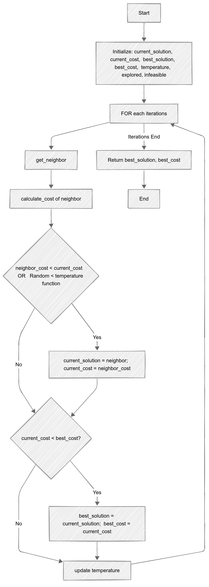
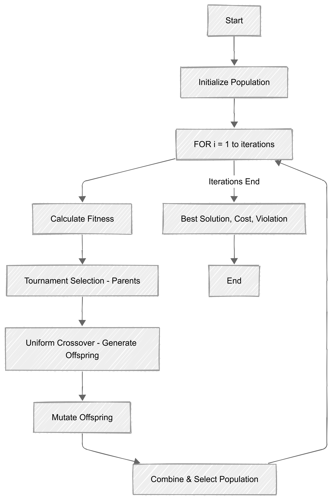
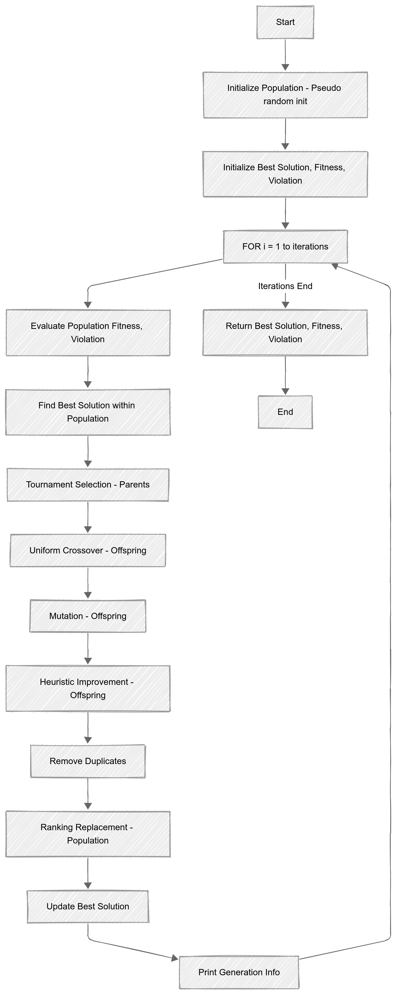
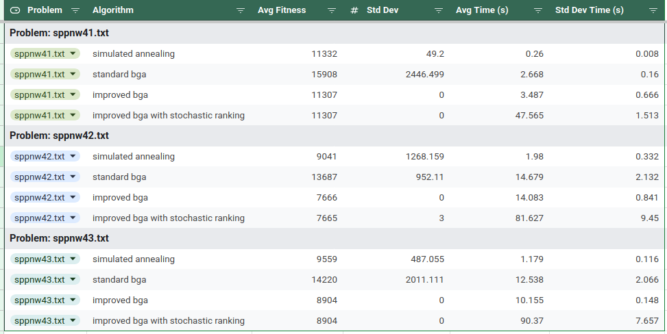
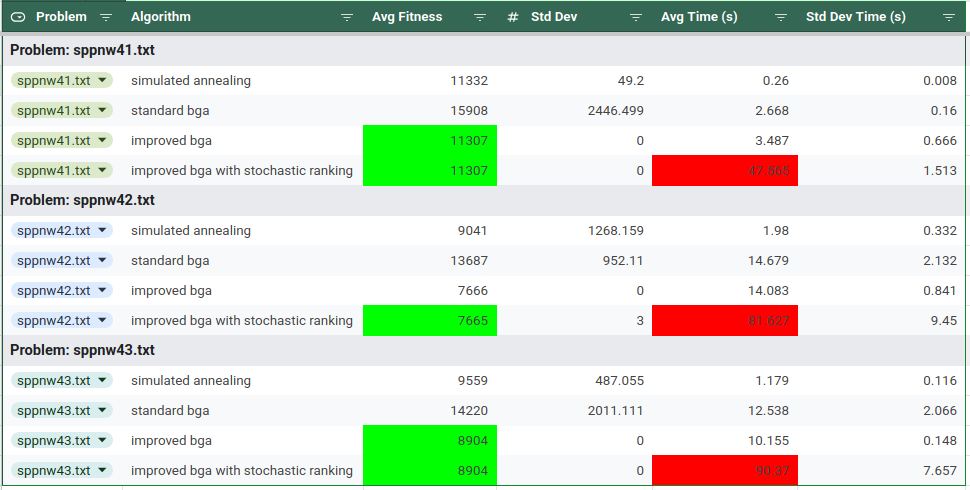

[TOC]

### Task 4 :  Introduce the SA, the standard BGA and the improved BGA.

#### Simulated Annealing

##### Pseudocode 

##### Flowchart

#### Standard - BGA

##### Pseudo code

##### Flowchart

#### Improved - BGA

##### Pseudo code

##### Flowchart

### Task 5 : For each benchmark problem, list the average result and standard deviations obtained over 30 independent runs of each algorithm.

##### Result Table

### Task 6 : Similarity and difference between the ranking replacement method and the stochastic ranking method 

- ##### Difference
  
  - Ranking Replacement focuses on the **selection** of individuals for deletion after offspring are produced,  acts like a replacement algorithm. 
  - Stochastic Ranking focuses on the **ordering** ranking/sorting of the population, acts like a sorting algorithm. Other than unfitness and fitness value, Stochastic Ranking  has $p_f$ probabilistic value , through which ($p_f<0.5$) we can prioritise feasible solutions  (zero constraint violation) while allowing exploration of infeasible regions.
- ##### Similarity
  
  - Both handles constraint violation.
  - Both considers unfitness(constraint violation) and fitness value(objective function).

### Task 7 :  Compare the results from SA, the standard BGA and the improved BGA with an in-depth discussion.

##### Experiment details :

- trials : 30 (independent)
- Standard BGA
  - initial population size :1000
  - Iteration : 100
- Improved BGA and Imporved BGA with Stochastic ranking
  - initial population size :100
  - Iteration : 100

#### Overall Observations:

##### Fitness score analysis

**Improved Genetic Algorithms (ibga and ibgasr)**: Across all three benchmark problems (sppnw41.txt, sppnw42.txt, sppnw43.txt), the improved basic genetic algorithm (ibga) and the improved basic genetic algorithm with stochastic ranking (ibgasr) consistently **achieve the lowest average fitness values**. This indicates that the enhancements made to the basic genetic algorithm are highly effective in finding better solutions.

**Stochastic Annealing (sa) is Competitive:** Simulated annealing (sa) demonstrates competitive performance, particularly on sppnw41.txt, where it achieves results comparable to the improved genetic algorithms. However, its performance is less consistent across other problems.

**Basic Genetic Algorithm (bga) is Outperformed:** The standard basic genetic algorithm (bga) is consistently outperformed by all other algorithms in terms of solution quality (average fitness). This highlights the importance of incorporating improvements or alternative search strategies.

**Impact of Stochastic Ranking (ibgasr):** In terms of average fitness, the addition of stochastic ranking (ibgasr) to the improved genetic algorithm does not significantly affect the solution quality. However, it does have a noticeable impact on the execution time ie higher execution time.

##### Execution Time Variation

There are substantial differences in execution time between the algorithms. The improved genetic algorithms (ibgasr) generally take longer than than other algorithm considered, likely due to the additional computational overhead of the stochastic ranking process.

##### Standard Deviation Analysis

The improved genetic algorithms (ibga and ibgasr) show very low or zero standard deviations in fitness, indicating **high consistency in solution quality** across multiple runs. Simulated annealing (sa) and the basic genetic algorithm (bga) exhibit higher standard deviations, suggesting greater variability in solution quality across runs.

##### Initial population size

For Standard BGA initial population size of 1000 is kept for faster convergence with 100 iterations. Where improved BGA required  only initial population of 100 is required and converged in less than 30 iterations

#### Summary

- The improved genetic algorithms demonstrate superior performance in terms of solution quality and consistency.
- Stochastic annealing offers a viable alternative, especially when execution time is a concern.
- Adding stochastic ranking increases runtime.

